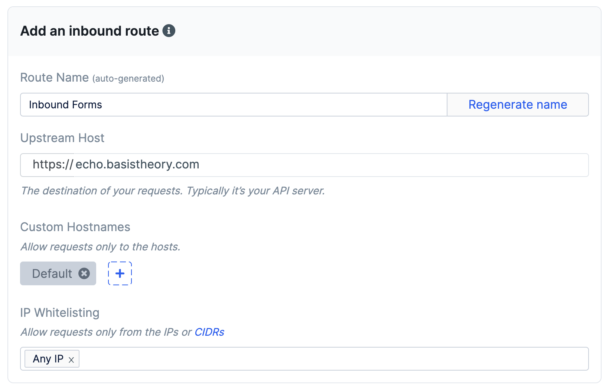
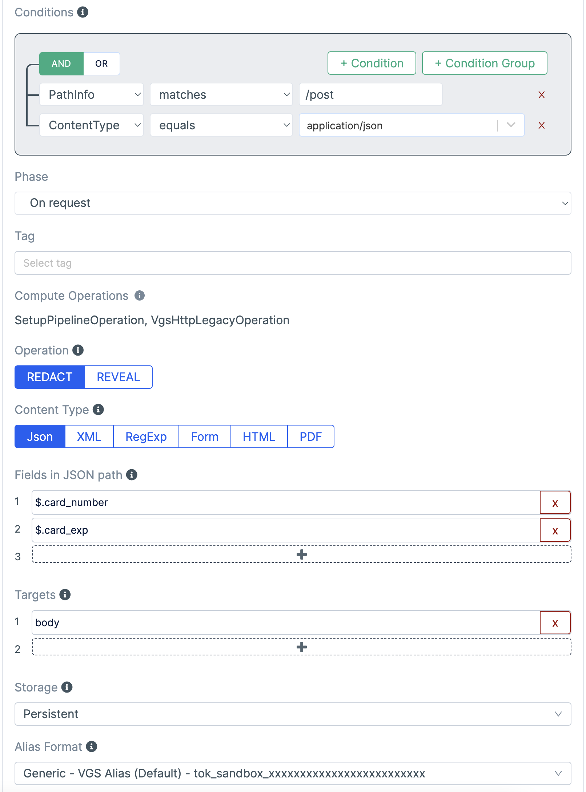
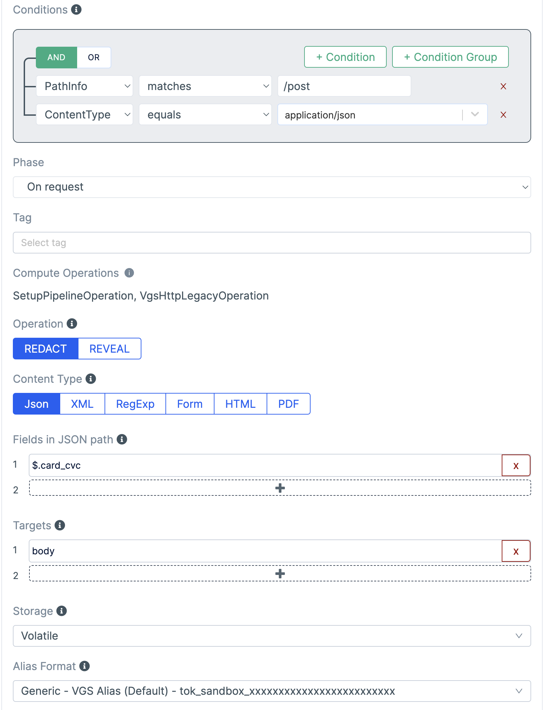
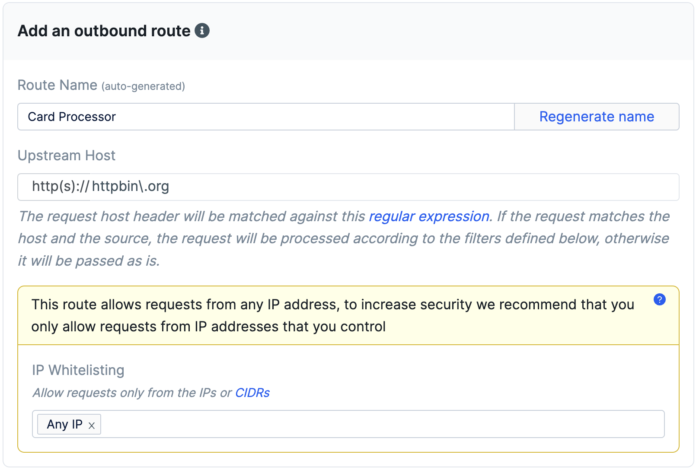
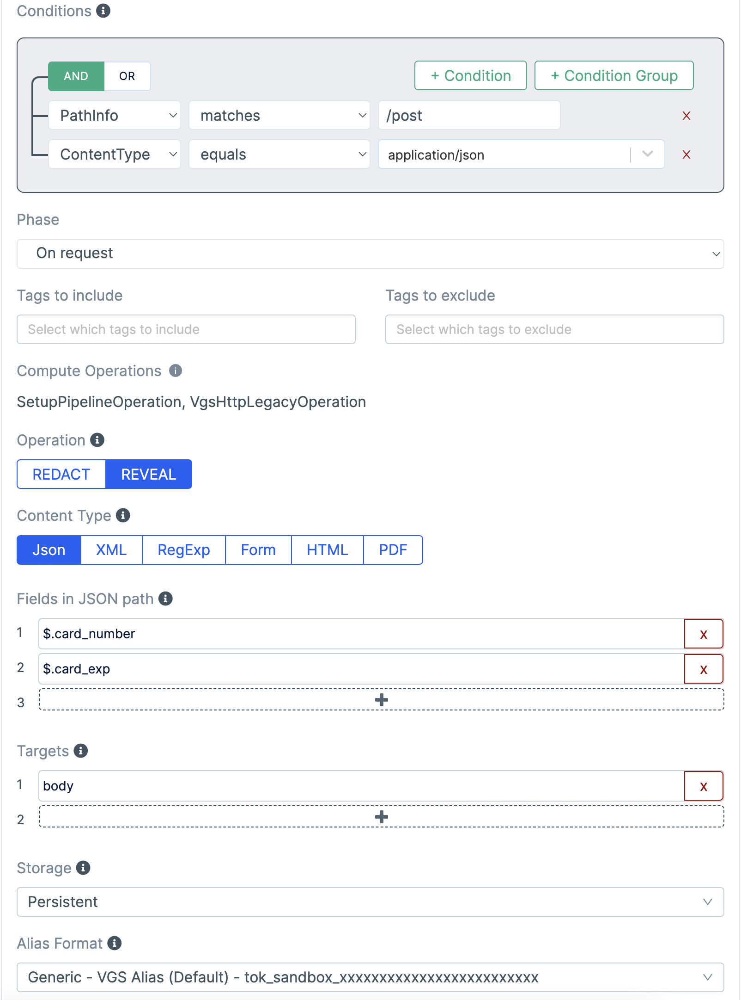
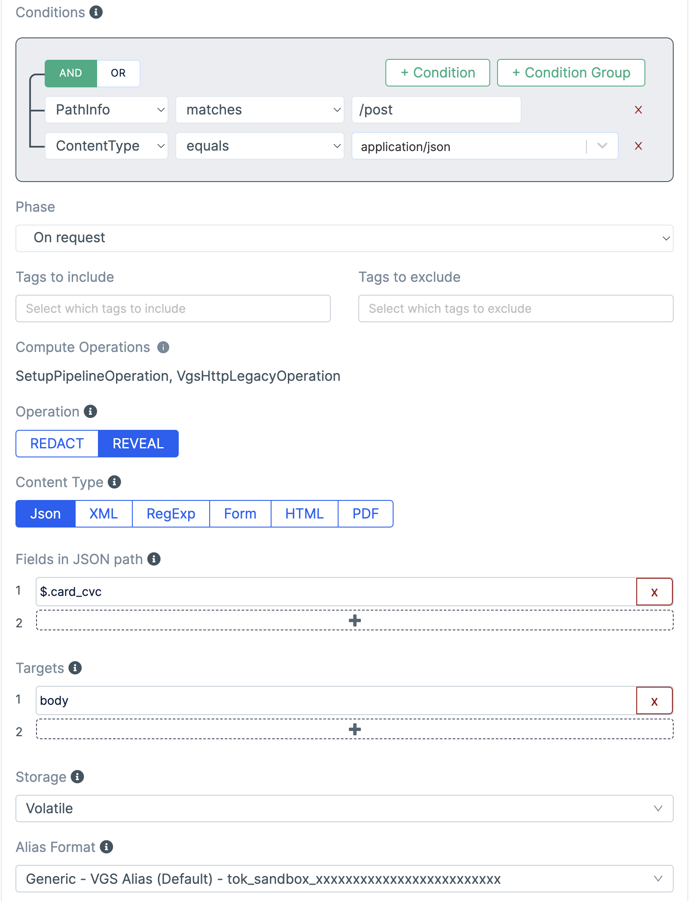

# Step 1 - Existing Application

This application demonstrates collecting credit cards with [VGS Collect.js](https://www.verygoodsecurity.com/docs/vgs-collect) and utilizing their proxy to send to an echo service.

## Create Environment variables

Create a `.env.local` file with your secrets

```
NEXT_PUBLIC_VGS_VAULT_ID=
VGS_USERNAME=
VGS_PASSWORD=
NODE_TLS_REJECT_UNAUTHORIZED=0
```

`NODE_TLS_REJECT_UNAUTHORIZED` is set to `0` to reject self-signed SSL certificates from VGS. This can be removed, but the Sandbox and CA certificates need to be configured in the `proxy.js` API class.

## Get Vault ID
1. When logged into VGS, navigate to the Dashboard
1. Click the copy icon next to the `Vault ID` at the top of the page
1. Copy the value to the `.env.local` file as the `NEXT_PUBLIC_VGS_VAULT_ID` value

## Generate Credentials
1. Navigate to Vault Settings --> Access Credentials
1. Click `Generate credentials`
1. Copy the resulting `Username` and `Password` to the `.env.local` file as `VGS_USERNAME` and `VGS_PASSWORD` respectively

## Create Inbound Route
1. Set upstream host to `echo.basistheory.com` (this will represent your API) 
1. Add filter for `/post` path with `$.card_number`, and `$.card_exp` as `REDACT` and `PERSISTENT` storage.

1. Add filter for `/post` path with `$.card_cvc` as `REDACT` and `VOLATILE` storage.


## Create Outbound Route
1. Set upstream host to `httpbin\.org` (this will represent a card processor) 
1. Add filter for `/post` path with `$.card_number` and `$.card_exp` as `REVEAL` and `PERSISTENT` storage.

1. Add filter for `/post` path with `$.card_cvc` as `REVEAL` and `VOLATILE` storage.


## Key Integration Spots

| File                                                     | Description                           |
| -------------------------------------------------------- | ------------------------------------- |
| [`pages/index.js`](./pages/index.js)                     | Location of VGS form elements         |
| [`components/Home.hooks.js`](./components/Home.hooks.js) | VGS Collect is initialized and called |
| [`pages/api/proxy.js`](./pages/api/proxy.js)             | Outbound Proxy call to VGS            |

## Running

Run the development server:

```bash
npm run dev
# or
yarn dev
```