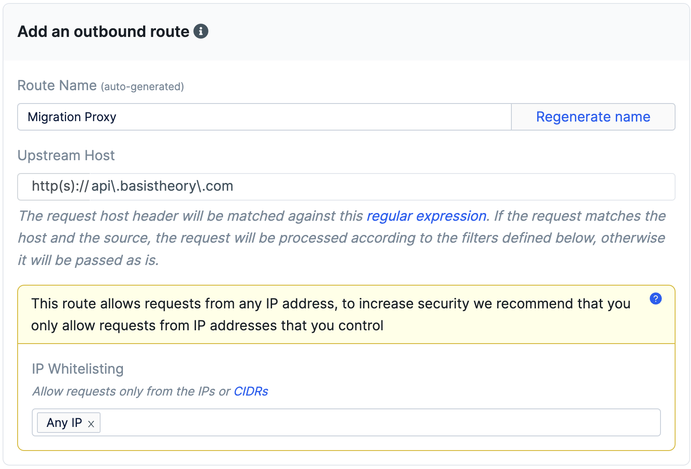
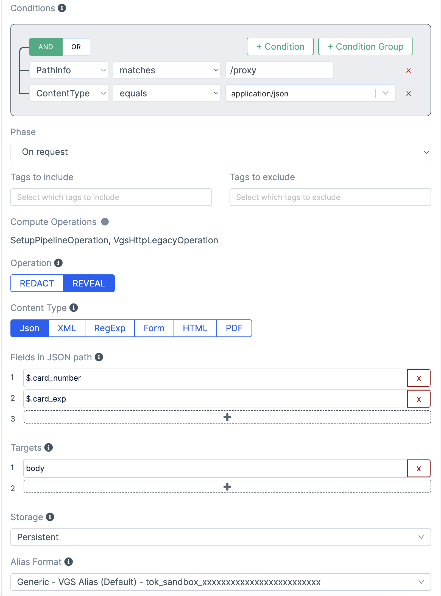
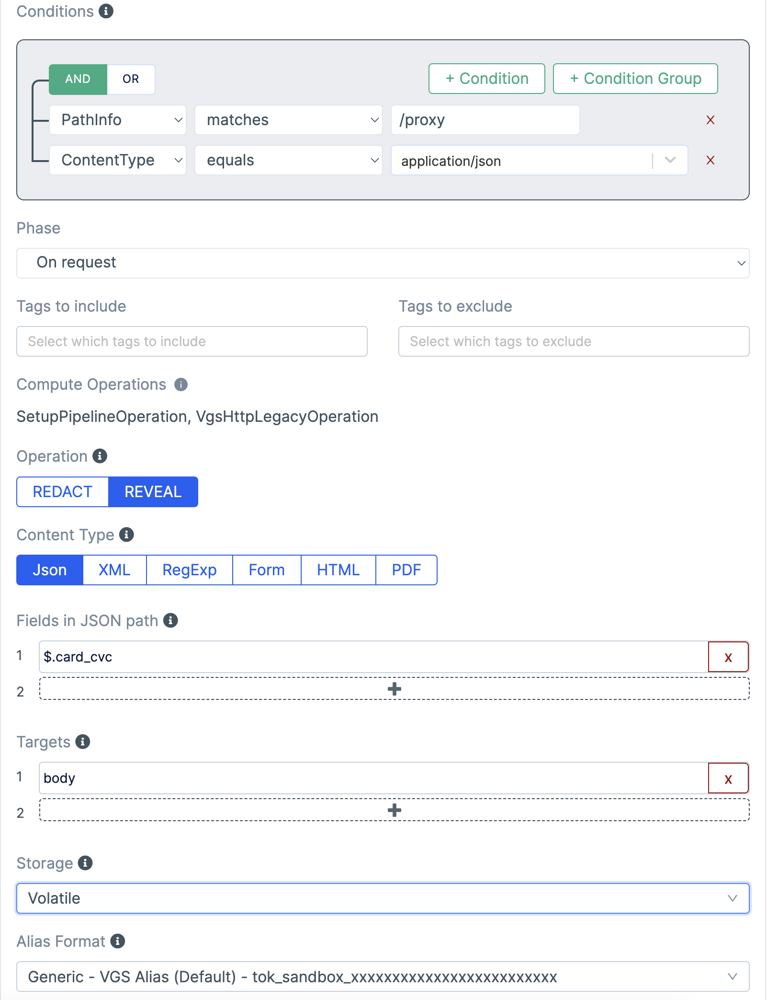

# Step 3 - Migrate Data from VGS to Basis Theory

This application demonstrates how to migrate data from VGS utilizing a VGS Outbound Proxy to detokenize the data and forward it to a [Basis Theory Proxy](https://developers.basistheory.com/docs/concepts/what-is-the-proxy/). The Basis Theory Proxy is configured with a [Request Transform](https://developers.basistheory.com/docs/api/proxies/pre-configured-proxies#request-transforms) to tokenize the payload and forward the resulting token to our backend API.

We need to the ability to tokenize our VGS tokens as a Basis Theory `card` token. In order to do this, we will need to intercept a request to our API from the VGS Outbound Proxy, tokenize multiple VGS tokens as a single Basis Theory token, and forward it to our backend API endpoint.

## Create Environment variables

Create a `.env.local` file with your secrets

```
BASIS_THEORY_PROXY_KEY=
VGS_VAULT_ID=
VGS_USERNAME=
VGS_PASSWORD=
NODE_TLS_REJECT_UNAUTHORIZED=0
```

Copy the values you created for `NEXT_PUBLIC_VGS_VAULT_ID`, `VGS_USERNAME`, and `VGS_PASSWORD` from [Step 1](../01-existing-application/).

`NODE_TLS_REJECT_UNAUTHORIZED` is set to `0` to reject self-signed SSL certificates from VGS. This can be removed, but the Sandbox and CA certificates need to be configured in the `proxy.js` API class.


## Create a Basis Theory Private Application
We need a private application which will be injected into our Request Transform code to enable us to tokenize the inbound request body.

1. Run the following command in your terminal to create a Basis Theory Private App:
   ```bash
   curl "https://api.basistheory.com/applications" \
    -H "BT-API-KEY: <MANAGEMENT API KEY>" \
    -H "Content-Type: application/json" \
    -X "POST" \
    -d '{
      "name": "Migration Proxy App",
      "type": "private",
      "permissions": [
        "token:create"
      ]
    }'
   ```
2. Save the `id` from the response as it will be used in the next step.

## Create a Basis Theory Proxy

This will be the endpoint collecting the VGS tokens data and combine it into a single Basis Theory token.

We extract the parts of the request body, call tokenize to create a new `card` token, and return the card token ID:

```js
module.exports = async function (req) {
  const expirationDateParts = req.args.body.card_exp.split("/");

  const token = await req.bt.tokenize({
    type: "card",
    data: {
      number: req.args.body.card_number,
      expiration_month: parseInt(expirationDateParts[0].trim()),
      expiration_year: parseInt(`20${expirationDateParts[1].trim()}`),
      cvc: req.args.body.card_cvc,
    },
  });

  return {
    raw: {
      headers: req.args.headers,
      body: {
        cardTokenId: token.id,
      }
    }
  };
};
```

1. Run the following command to store the JavaScript code in a variable:
   ```bash
   # actual code omitted for simplicity
   javascript='module.exports = async function (req) {...}'
   ```

2. Run the following command in your terminal to create the Proxy:
   ```bash   
   curl "https://api.basistheory.com/proxies" \
     -H "BT-API-KEY: <MANAGEMENT API KEY>" \
     -H "Content-Type: application/json" \
     -X "POST" \
     -d '{
       "name": "Migration Proxy",
       "destination_url": "https://echo.basistheory.com/post",
       "require_auth": false,
       "request_transform": {
         "code": '"$(echo $javascript | jq -Rsa .)"'
       },
        "application": {
          "id": "<PRIVATE APPLICATION ID>"
        }
     }'
   ```

3. Copy the `key` value in the response to the `.env.local` file as the `BASIS_THEORY_PROXY_KEY` value

## Create a VGS Outbound Proxy
1. Set upstream host to `api\.basistheory\.com` 
2. Add filter for `/proxy` path with `$.card_number` and `$.card_exp` as `REVEAL` and `PERSISTENT` storage.

3. Add filter for `/proxy` path with `$.card_cvc` as `REVEAL` and `VOLATILE` storage.


## Replace the VGS Token IDs
The tokens in [index.js](./index.js) need to be replaced with actual tokens from your vault. These can be loaded from a file or database.

## Running

Run the migration script:

```bash
npm start
# or
yarn start
```